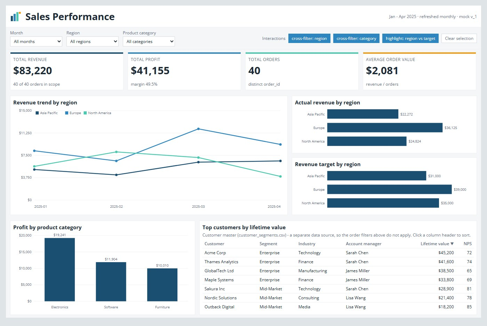

# Tableau Dashboard Plugin

A **Claude Code plugin** that turns a free-text dashboard request into an interactive HTML demo and a Replace-Data-Source-ready Tableau `.twbx` — through a guided, approval-gated workflow split across **8 single-job skills** plus a router.

## Why the plugin (and why it replaces the old monolith)

The original release was a single monolithic skill (`/tableau-dashboard-creator`) that loaded the *entire* workflow — every step's instructions, references, and snippets — into one long conversation. That is expensive: context grows step over step, and on a smaller plan you run out of budget before you reach the workbook.

This plugin breaks that monolith into **8 independent skills**, each running in its **own fresh conversation** and handing off to the next **through files on disk**. No single skill ever loads the whole workflow — only its own slice of the contract. The result is dramatically lower per-step token use, so the full pipeline is practical to run **even on a $20 Claude Pro license**, not just higher tiers.

> **Portability.** Each skill is a plain `SKILL.md` file, so the *content* ports to Cursor, Codex, or any other agentic tool that reads skill files. The install and invocation documented here are specific to Claude Code's plugin system.

## Prerequisites

| Requirement | Details |
|-------------|---------|
| **Claude Code** | The plugin targets [Claude Code](https://docs.anthropic.com/en/docs/claude-code)'s plugin system (`/plugin install`, namespaced skills). |
| **Python 3.9+** | The helper scripts use `pandas` 2.x (which requires 3.9+). |
| **Python dependencies** | `pip install -r requirements.txt` — `pandas`, `python-dotenv`, `requests` (published-datasource route), `lxml` (workbook XSD validation). |
| **Tableau Desktop** | Only needed to open the generated `.twbx` workbook. |

---

## Installation

### Option 1 — Marketplace (recommended)

Add this repo as a plugin marketplace, then install the plugin. Works straight from GitHub, no clone, and picks up updates:

```
/plugin marketplace add https://github.com/laviDrori0702/tableau-dashboard-creator-skill.git
/plugin install tableau-dashboard-plugin@dashboard-creation-tool
```

Use the **HTTPS URL** (as above), not the `owner/repo` shorthand — the shorthand clones over SSH and fails if you don't have GitHub SSH keys configured. (If you cloned locally, point the marketplace at the checkout instead: `/plugin marketplace add ./path/to/tableau-dashboard-creator-skill`.)

### Option 2 — Quick local test

For hacking on the plugin itself, load it for the current session only:

```bash
git clone https://github.com/laviDrori0702/tableau-dashboard-creator-skill.git
cd tableau-dashboard-creator-skill
claude --plugin-dir .
```

### Invoking the skills — mind the namespace

Plugin skills are **namespaced by the plugin name**. Typing `/tableau-init` finds nothing; the actual command is:

```
/tableau-dashboard-plugin:tableau-init
/tableau-dashboard-plugin:tableau-route      ← "what step am I on / what's next?"
```

Every skill has `disable-model-invocation: true`, so Claude never auto-runs them — you drive the workflow explicitly, one step at a time. Not sure where you are? Run the router (`…:tableau-route`) and it tells you the single next skill to run.

---

## The workflow — 8 steps + a router

Each step is owned by exactly one skill, reads a known set of artifacts, and writes exactly one primary artifact. Run them in order (the router enforces it); approve each before moving on.

| # | skill (`/tableau-dashboard-plugin:…`) | what it does | reads → writes | skippable |
|---|----------------------------------------|--------------|----------------|-----------|
| 1 | `tableau-init`   | Scaffold the project; record target Tableau version | — → `STATE.md` + `scaffold/` demo examples | no |
| 2 | `tableau-intake` | Structure the free-text request into a PRD | `DASHBOARD-REQUEST.md` / pasted text → `PRD.md` | yes |
| 3 | `tableau-data`   | Acquire & profile the data | `data/*.csv` *(or published-ds via VDS)* → `DATA-MODEL.md` + `data/*.csv` | no |
| 4 | `tableau-brand`  | Extract design tokens from branding | `branding/` → `DESIGN-TOKENS.md` | yes |
| 5 | `tableau-plan`   | Blueprint: screen size, slots, KPIs, charts, filters, interactions (stable ids) | `DATA-MODEL.md` (+ `PRD.md`, `DESIGN-TOKENS.md`) → `DASHBOARD-PLAN.md` | no |
| 6 | `tableau-mock`   | Interactive HTML demo from real sample data | `DASHBOARD-PLAN.md`, `data/*.csv` → `mock-version/v_N/mock.html` | no |
| 7 | `tableau-spec`   | Map every mock element to a concrete Tableau construct | `mock.html`, `DASHBOARD-PLAN.md` → `mock-version/v_N/IMPLEMENTATION-SPEC.md` | no |
| 8 | `tableau-build` *(views in development)* | Generate the version-aware, XSD-validated workbook | `IMPLEMENTATION-SPEC.md`, `DATA-MODEL.md`, `data/*.csv` → `mock-version/v_N/dashboard.twbx` | no |

> **`tableau-route`** is the compass, not a step: it reads `STATE.md` and reports the single next skill to run. It only recommends — it never runs another skill for you.

> **Status — step 8 is landing in pieces.** Steps 1–7 (`init` → `spec`) are complete. `tableau-build` today derives and validates the build manifest and assembles a workbook that Tableau opens: datasources (live, with the CSVs packaged into the `.twbx`), a dashboard sized from the approved mock, windows, and version targeting, checked by both validators on every build. The worksheet bodies (shelves, encodings, marks) and the dashboard's zone tree are the remaining piece, so the views are still empty. Tableau has announced a **native skill** for generating a workbook from a spec — when it ships we intend to integrate it as the build step rather than maintain a parallel generator, so the exact shape of step 8 may change.

Skippable steps (`intake`, `brand`) let you go straight from a scaffolded project to planning with sensible fallbacks (the raw request text; neutral styling).

### How the skills hand off — the file model

No skill loads the whole workflow; they coordinate entirely through files at your project root.

- **`STATE.md`** — the project manifest. Created by `tableau-init`, updated by every later skill. Holds metadata (target Tableau version, `data_mode`, `current_version`) and a Steps table with a per-step status (`pending` | `approved` | `skipped` | `stale`).
- **Handoff artifacts are `UPPER-KEBAB.md`** (`PRD.md`, `DATA-MODEL.md`, `DESIGN-TOKENS.md`, `DASHBOARD-PLAN.md`, `IMPLEMENTATION-SPEC.md`); **your inputs are lowercase** (`branding/`, `data/`, `datasources.json`, `.env`, `DASHBOARD-REQUEST.md`). The casing is deliberate.
- **Three rules every skill honors:** *ordering* — a step refuses to run until each required-read producer is resolved and its artifact exists; *staleness* — re-running a step flips every downstream `approved` step to `stale`; *versioning* — root `*.md` handoffs are overwritten in place, while deliverables (`mock.html`, `IMPLEMENTATION-SPEC.md`, `dashboard.twbx`) live under `mock-version/v_N/`, all anchored to the mock's version.

> **[`CONTRACT.md`](CONTRACT.md) is the source of truth** for the full step graph, the `STATE.md` schema, artifact naming, and the ordering/staleness/versioning rules. Each `SKILL.md` restates only its own slice; when a skill and the contract disagree, the contract wins.

---

## Providing your inputs

Run `tableau-init` first — it scaffolds a `scaffold/` folder of examples you can copy and edit. Then supply, at your project root:

- **Request** — a `DASHBOARD-REQUEST.md`, or just paste the request as text when you run `tableau-intake`.
- **Data (choose one):**
  - **CSV (default, zero-credential):** drop your files in `data/*.csv`.
  - **Published datasource:** provide `datasources.json` + a `.env` (`TABLEAU_SERVER`, `TABLEAU_SITE`, `TABLEAU_PAT_NAME`, `TABLEAU_PAT_SECRET`, …); `tableau-data` samples it through the VizQL Data Service into `data/*.csv`. See `skills/tableau-data/SKILL.md` and `CONTRACT.md` §3.2 for the exact fields.
- **Branding (optional):** a `branding/` folder (`branding.md` spec and/or an org `template.twb`, logo/icons). Skip it and `tableau-brand` runs a short interview or falls back to neutral styling.

---

## Repository structure

```
tableau-dashboard-plugin/
├── .claude-plugin/
│   ├── plugin.json            # plugin manifest
│   └── marketplace.json       # marketplace entry (dashboard-creation-tool)
├── CONTRACT.md                # source of truth: inter-skill API
├── skills/                    # the active v2 plugin — 8 skills + router
│   ├── tableau-init/  tableau-intake/  tableau-data/  tableau-brand/
│   ├── tableau-plan/  tableau-mock/    tableau-spec/   tableau-build/
│   └── tableau-route/          # the router
│       └── <SKILL.md, scripts/, references/, skeleton/ per skill>
├── skill/
│   └── tableau-dashboard-creator/   # legacy v1 monolith — kept for reference only
├── tests/                     # contract/skill test suite (python -m pytest -q)
├── demo/                      # worked example (see note below)
├── requirements.txt
└── README.md
```

---

## Migrating from v1

If you used the old single skill: the workflow now lives in this plugin. Install it (above) and drive it with the namespaced skills, starting at `/tableau-dashboard-plugin:tableau-init` and using `/tableau-dashboard-plugin:tableau-route` to know what's next. The v1 monolith is preserved under `skill/tableau-dashboard-creator/` as a reference — it is no longer the recommended path and receives no new features.

## Demo

`demo/` is a worked Sales Performance example. **Note:** it currently reflects the **v1** artifact names and layout; a refresh to the v2 workflow (`STATE.md`, `DATA-MODEL.md`, `IMPLEMENTATION-SPEC.md`, `mock-version/`) is pending ([#30](https://github.com/laviDrori0702/tableau-dashboard-creator-skill/issues/30)). Until then, treat `CONTRACT.md` and the per-skill `references/` as the authoritative shape of each artifact.



*The mock step generates an interactive HTML preview of your dashboard before any Tableau work.*

---

## Key constraints (Tableau fidelity)

- **No rounded corners below Tableau 2026.1** — `border-radius` only renders in 2026.1+; for older targets keep the mock square-cornered unless you accept the divergence.
- **No box shadows** — not natively supported in Tableau.
- **Container hierarchy** must follow Tableau's zone model (layout-basic → layout-flow → sheets).
- **Fallback-driven choices are disclosed** — when a skill uses a Tableau default for missing input, it says so.
- **`tableau-build` still emits empty views** — the workbook it produces opens cleanly and carries the data, but the shelves/encodings are the remaining piece (see the status note above); always review the generated workbook in Tableau Desktop before publishing.

## Contributing

See [CONTRIBUTING.md](CONTRIBUTING.md) for reporting issues, suggesting features, and submitting pull requests.

## License

[MIT License](LICENSE).
